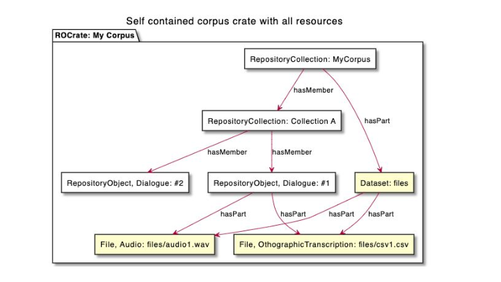

# General Information

Crate-O is a browser-based editor for [Research Object Crates (RO-Crate)](https://www.researchobject.org/ro-crate). RO-Crate is a flexible, developer-friendly approach to linked-data description and packaging. 

Crate-O is designed to:
- describe files on a user’s computer and to add contextual information about those files,
- skip the files and describe abstract contextual entities such as in a Cultural Collection or an encyclopaedia, or
- annotate existing resources elsewhere on the web.

Crate-O works only with [Google Chrome](https://google.com/chrome) and [Microsoft Edge](https://microsoft.com/edge) at this stage as it describes files on the user's computer, and saves RO-Crate metadata there. We will be releasing versions that work with online resources directly which will be compatible with other browsers (see the [Roadmap](https://github.com/Language-Research-Technology/crate-o#roadmap--backlog)).

While the current version of Crate-O is designed for editing self-contained RO-Crates (and works fine with crates containing tens of thousands of entities), our roadmap includes editing fragments of larger linked-data resources, and integration with Arkisto repositories such as the Oni repository, data API and search portal.

Crate-O is currently developed by the [Language Data Commons of Australia (LDaCA)](https://www.ldaca.edu.au/), under the guidance of Peter Sefton as technical lead. If the tool is adopted in other contexts (we are in talks with a few groups about this) then we aim to establish a steering committee/reference group to help guide development.

 

# Crate-O Use Cases

Crate-O can be used to:
- Describe data collections
- Add and edit the metadata fields of a data collection
- Submit a collection to the LDaCA Portal
- Edit a schema

 

## Main Start Page Options

From the main toolbar, the following options are available:

File Option | Description
--- | ---
Open Directory | Select a directory/folder to describe your research.
Load Files | Loads files from the selected directory into this RO-Crate.
Bulk Add | Select a spreadsheet from a different directory to assist you with metadata description. This will append to your existing RO-Crate if there is already one created.
Save | Save the state of this page into your RO-Crate. This will create an _ro-crate-metadata.json_ file or append data into an existing _ro-crate-metadata.json_.
Close | Closes without saving.
Mode | Select a predefined mode or load one from your computer.

 

## RO-Crate Collection Hierarchy

The diagram below shows the hierarchical relationship between collections, objects and files in a corpus, together with the metadata that these relationships are organised by.

The metadata is organised by the various kinds of entities recognised in the ontology documented at schema.org at least partly based on the RDF framework.

Entity | Definition
--- | ---
Class | (rdfs: Class) Used to classify resources. An instance of an rdfs: Class is defined using the predicate rdf: type. Classes in Language Data Commons include CollectionEvent, CollectionProtocol, DataDepositLicense, DataLicense and DataReuseLicense.
Property | (rdfs: Property) are used to add attributes to classes. Similar to how we define classes, we can define instances of properties to add attributes to statements.
DefinedTerm | A 'word, name, acronym, phrase, etc. with a formal definition' and they are 'often used in the context of category or subject classification.' DefinedTerms allow us a) to have accurate definitions of the values we want to give to properties and b) to group such definitions in DefinedTermSets which can function as controlled vocabularies.

For more details on these entities and their related metadata, see [Metadata for Language Data](https://ldaca.gitbook.io/metadata-for-language-data/).

 

## General Navigation

- __Selected Directory__ shows the directory or folder you currently have open.
- Below __Selected Directory__, you will see a home icon followed by a file path that indicates where you are located in the collection levels. This will change as you navigate to different sublevels.
- Depending on the metadata group, different types of metadata will be available:

Metadata Group | Description
--- | ---
About | The core metadata for this RO-Crate and its subject matter.
Related People, Orgs & Works | The context for the creation of this RO-Crate; who made it, funded it etc.
Structure | How the parts of this RO-Crate relate, such as collection and object relationships.
Provenance | Detailed description of how entities were created, by whom and with which tools.
Space & Time | Where and when the data was collected; the times and places it mentions or describes.
Software & Hardware | For computer programs and execution environments that could be used to create data, have created data, or are being packaged and described.
Others | Other properties not in the above categories. Note if you find a property in `Other` that should be in one of the above groups or have other suggestions please raise an issue here on github

There are several compulsory metadata fields required for each collection. To view these, go to [TODO: add link].

On the right-hand panel, there are some further options related to navigating and creating metadata entities:
- __Create New Entity__: [TODO: Needs description].
- __Links from__: When located in a sub-group, select to view the parent group(s).
- __All Entities__: Select to view all metadata associated with your collection.
- __Unlinked Entities__: Select to view all metadata that currently is not linked to any properties.
